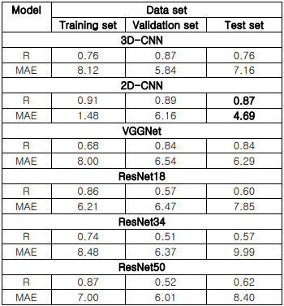
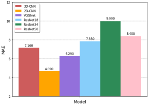
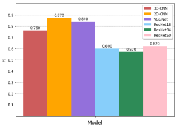

# 
 A Performance Evaluation of CNN for Brain Age Prediction   Using Structural MRI Data 

    

### Contents
1. [Overview](#overview)
2. [Requirements](#requirements)
3. [Languages and Development Tools](#languages-and-development-tools)
4. [Issue](#issue)
5. [Usage](#usage)
6. [Architecture](#architecture)
7. [Result](#result)
8. [Conclusion](#conclusion)
9. [Reference](#reference)
10. [Developer](#developer)

### Overview
[[Paper PDF]](https://drive.google.com/file/d/1HIQyfWCf2v_nSxT9akmXAhBki5N1vN7B/view) 
Brain age has been proposed as a biomarker for early diagnosis and prediction of neurodegenerative diseases and mental diseases. Recent advances in deep learning techniques improve the accuracy of brain age prediction using magnetic resonance imaging (MRI) data, and it is necessary to quantitatively compare and verify the accuracy of various deep learning-based models for brain age prediction. In this study, the performance of various convolutional neural network (CNN) based brain age prediction models was compared and evaluated using structural T1 weighted MRI data. We used Mean Absolute Error (MAE) and correlation (R) of actual age and predicted brain age as performance evaluation indicators to evaluate the performance of the brain age prediction model. Performance evaluation results show that the 2D-CNN model performed the highest with MAE of 4.69 and R of 0.87 among the tested CNN architecture-based deep learning models. Performance evaluation of deep learning based brain age prediction models using T1 weighted MRI data is expected to improve the accuracy of brain age prediction models and the predictive power of accelerated aging in patients with neurodegenerative and mental diseases.

뇌연령(brain age)은 신경퇴행성 질환 및 정신질환을 조기 진단 및 예측하기 위한 생체지표로 제안되었다. 최근 딥러닝 기법의 발전은 자기공명영상(Magnetic Resonance Imaging, MRI) 데이터를 이용한 뇌연 령 예측의 정확도를 향상시키고 있으며, 뇌연령 예측을 위한 다양한 딥러닝 기반 모델의 정확도를 정량적으로 비교하고 검증할 필요가 있다. 본 연구에서는 뇌 구조적(structural) T1 강조 MRI 데이터를 이용하여 다양한 Convolutional Neural Network (CNN) 기반 뇌연령 예측 모델의 성능을 비교하고 평가하였다. 뇌연령 예측 모델의 성능을 평가하기 위해 실제연령과 예측된 뇌연령의 Mean Absolute Error(MAE)와 상관관계(Pearson Correlation Coefficient, R)를 성능 평가 지표로 사용하였다. 성능 평가 결과, 테스트한 CNN 아키텍처(architecture) 기반 딥러닝 모델중 2D-CNN 모델이 4.69의 MAE와 0.87의 R로 가장 높은 성능을 보였다. T1 강조 MRI 데이터를 이용한 딥러닝 기반 뇌연령 예측 모델의 성능 평가를 통해 뇌연령 예측 모델의 정확도를 개선하고 신경퇴행성질환 및 정신질환 환자의 가속 노화 예측력을 향상시킬 수 있을 것으로 기대한다.

### Requirements
+ python 3.6

### Languages and Development Tools
 

### Issue
+ You can use main.py of each folder for reproduction.
+ 2D-RNN is modifying
+ ResNet modeling takes a long time !! 

### Usage
.
├── 2DCNN/ 
│   ├── config/ 
│   │   └── config.py 
│   ├── data/ 
│   │   └── splits.py 
│   ├── lib/ 
│   │   ├── data/ 
│   │   │   ├── mnist.py 
│   │   │   └── util.py 
│   │   ├── utils/ 
│   │   │   ├── logging.py 
│   │   │   ├── math.py 
│   │   │   ├── optimizer.py 
│   │   │   ├── os.py 
│   │   │   ├── samplers.py 
│   │   │   └── torch_utils.py 
│   │   ├── base_model.py 
│   │   ├── base_trainer.py 
│   │   └── standard_nn.py 
│   ├── src/ 
│   │   ├── arch/ 
│   │   │   ├── brain_age_3d.py 
│   │   │   ├── brain_age_slice_lstm.py 
│   │   │   └── brain_age_slice_set.py 
│   │   ├── common/ 
│   │   │   ├── data/  
│   │   │   │   └── ukbb_brain_age.py 
│   │   │   ├── data_utils.py 
│   │   │   └── dataset.py 
│   │   └── models/ 
│   │       └── regression.py 
│   ├── tests/ 
│   │   └── verify_mri_lstm.py 
│   └── main.py 
├── 2DRNN/ 
│   ├── src/ 
│   │   ├── data_loader.py 
│   │   ├── main.py 
│   │   └── model.py 
│   └── weights/ 
│       └── epoch=63-step=25919.ckpt 
└── 3DCNN_VGGNet/ 
    ├── internally_replaced_utils.py 
    ├── config.json 
    ├── dataset.py 
    ├── main.py 
    ├── model.py 
    ├── model_resnet.py 
    ├── sliced_whole_validation.py 
    └── transforms.py 

### Architecture
+ Data
    + Data
        + T1 weighted MRI data
        + Excel data including information of the person who took the MRI
         
    + Preprocessing
        + MRI data
            1. Information Non-Uniformity(INU) correction
            2. Skull removal
            3. Size (121, 145, 121)
        + Excel data
            1. Imputation (average age)
            2. Duplicate data removal
        + Split
            1. Split each data set to have a similar distribution and range of age
	    
	    

+ Model
    + Pre-trained model
        + 2D-CNN, 3D-CNN, VGGNet, ResNet18, ResNet34, ResNet50
         
    + Setting
        + 3D-CNN, VGGNet, ResNet
            1. batch size 16
            2. weight decay and learning rate 0.0006
        + 2D-CNN
            1. batch size 8
            2. wegith decay and learning rate 0.0001
        + Other settings
            1. Adam optimizer
            2. 100 epoch
          
+ Evaluation Metrics
    + Mean Absolute Error, MAE
    + Pearson Correlation Coefficient, R

### Result

   

 Performance evaluation result 
  
Overall, CNN-based deep learning models had MAE values of about 4.69-9.99 and R values of 0.57-0.8 for the test set. The 2D-CNN model showed the highest performance (MAE = 4.69, R = 0.87). Conversely, the ResNet model showed the lowest performance (MAE = 9.99, R = 0.57).   

   

 MAE of actual age and predicted brain age for each model for test set 
   

   

 R of actual age and predicted brain age for each model for the test set 
   

### Conclusion
In this study, the performance results of various CNN based models are quantitatively presented and can be used to develop deep learning-based brain age prediction models in the future. Performance evaluation of deep learning-based brain age prediction models using T1-emphasized MRI data is expected to improve the accuracy of brain age prediction models and improve the predictive power of accelerated aging in patients with neurodegenerative and mental diseases.

### Reference
[1] Pedro L. Ballester, Laura Tomaz da Silva, Matheus Marcon, Nathalia Bianchini Esper, Benicio N. Frey, Augusto Bunchweitz, Felipe Meneguzzi. Predicting Brain Age and Slice Level: Convolutional Neural Networks and Consequences for Interpretability, pp.1-8. 2021. 
[2] Umang Gupta, Pradeep K. Lam, Greg Ver Steeg, Paul M. Thompson. Improved Brain Age Estimation with Slice-based Set Networks, pp.1-3. 2021. 
[3] Pradeep K. Lam, Vigneshwaran Santhalingam, Parth Suresh, Rahul Baboota, Alyssa H. Zhu, Sophia I. Thomopoulos, Neda Jahanshad, Paul M. Thompson. Accurate brain age prediction using recurrent slicebased networks, pp.1-2. 2020. 
[4] B. A. Jonsson, G. Bjornsdottir, T. E. Thorgeirsson, L. M. Ellingsen, G. Bragi Walters, D. F. Gudbjartsson, H. Stefansson, K. Stefansson, M. O. Ulfarsson. Brain age prediction using deep learning uncovers associated sequence variants, p.2. 2019. 
[5] Muhammad Shahid Bhatti, Muhammad Usman Akram, Muhammad Ajmal, Ayesha Sadiq, Saif Ullah, Muhammad Shakil. Information Extraction From Images, pp.1273-1276. 2014. 
[6] CAT, http://www.neuro.uni-jena.de/cat/ 
[7] James H Cole, Rudra P K Poudel, Dimosthenis Tsagkrasoulis, Matthan W A Caan, Claire Steves, Tim D Spector, Giovanni Montana. Predicting brain age with deep learning from raw imaging data results in a reliable and heritable biomarker, pp.8-9. 2017. 

### Developer
Hyunji Kim  

	
	
